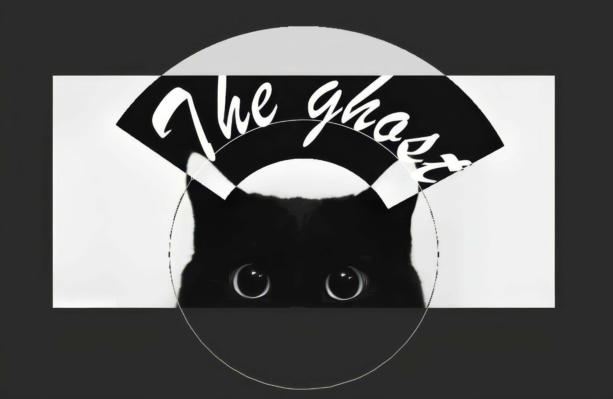

# Ghost (Farruhjon Otaev)

**Frontend Developer | AI Enthusiast | 16 y.o.**

**Email:** otaevfarruhjon@gmail.com  
**Telegram:** [@LittleWhiteGhost](https://t.me/LittleWhiteGhost)  
**Pinterest** [@Ghost](https://ru.pinterest.com/LittlewhiteGhost)

**Location:** Moscow, Zelenograd.

## About Me

Passionate 16-year-old frontend developer with a strong focus on clean, maintainable code and modern web technologies. Currently in my first year at IT Top College, actively seeking internship or junior developer opportunities. Experienced in building full-stack web applications, integrating AI/LLM services, and creating secure, privacy-focused solutions. Strong believer in learning by building and continuous improvement.

## Key Achievements

- **Built 3+ production-ready web applications** with Firebase integration and custom authentication flows
- **Developed intelligent Telegram bot** serving 50+ users with OpenRouter LLM integration for automated group management
- **Implemented secure access control system** with confidentiality agreements and automated verification
- **Optimized web performance** achieving 90+ Lighthouse scores through code splitting and lazy loading
- **Self-taught developer** with 2+ years of hands-on coding experience and active open-source contributions

## Technical Skills

### Frontend Development

### Design & No-Code

### Backend & APIs

### AI & LLM Integration

### Tools & Workflow

---

## Featured Projects

### Ghost Style Store
**2024 - Present**

Premium e-commerce platform for clothing and footwear targeting young IT professionals. Features include real-time inventory management, secure checkout flow, responsive design, and Firebase-powered backend. Achieved 95+ Lighthouse performance score.

**Tech:** HTML5, CSS3, JavaScript, Firebase Auth & Firestore, Payment Integration

---

### Intelligent Telegram Bot with LLM
**2024 - Present**

Automated group management bot handling 50+ daily requests with OpenRouter LLM integration. Features: access request processing, confidentiality agreement enforcement, intelligent responses, user verification system, and admin dashboard. Reduced manual moderation time by 80%.

**Tech:** Node.js, Telegram Bot API, OpenRouter (GPT-4, Claude), SQLite, Cron Jobs

---

### Custom Authentication System
**2024**

Built secure authentication flow with Firebase and Google OAuth integration. Implemented JWT tokens, session management, password reset functionality, and role-based access control. Minimalistic UI with focus on security and user experience.

**Tech:** JavaScript, Firebase Auth, Google OAuth, JWT, Local Storage

---

### Focus Mode Productivity Bot
**2026**

Telegram bot helping users stay focused with periodic reminders and AI-powered photo verification. Features: task tracking, goal setting, mini-games, Hugging Face BLIP integration for result validation, and detailed productivity statistics.

**Tech:** Python, aiogram, APScheduler, Hugging Face API, SQLite

---

## Education

### IT Top College
**First Year Student | 2024 - Present**  
Focus: Software Development, Web Technologies

### Self-Taught Developer
**2022 - Present**  
Online courses, documentation, building projects

## Languages

- **Tajik** — Native
- **Russian** — Native
- **Uzbek** — Native
- **English** — Professional Working Proficiency (B2)

## Professional Skills

Problem Solving • Self-Learning • Attention to Detail • Time Management • Code Review • Documentation • Debugging • Team Collaboration

---

> "Learning by building, coding by doing." — Farruhjon Otaev

